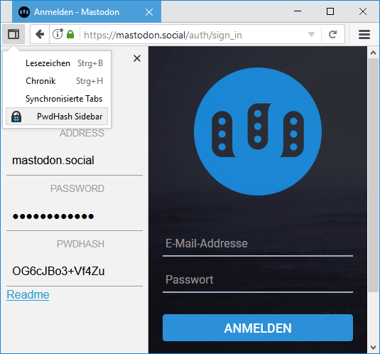

# PwdHash-Sidebar
[PwdHash](https://crypto.stanford.edu/PwdHash/) (von Stanford) erzeugt Passwörter, welche sicher gegen Diebstahl und Phising sind, indem es eine Kombination der Seitenadresse mit deinem Passwort hasht. 
Es ist verfügbar als Browsererweiterung ([Firefox](https://addons.mozilla.org/en-US/firefox/addon/pwdhash/), [Chrome](https://chrome.google.com/extensions/detail/dnfmcfhnhnpoehjoommondmlmhdoonca), [Opera <12](https://www.coredump.gr/pwdhash-for-opera/)), 
Apps ([Android](https://play.google.com/store/apps/details?id=com.uploadedlobster.PwdHash&hl=de), [iOS](https://itunes.apple.com/us/app/keygrinder/id354763605), [Windows](https://github.com/mgutekunst/WP8-PwdHash)), 
Skripte ([Ruby](https://github.com/kizzx2/pwdhash.rb), [Python](https://pypi.python.org/pypi/pwdhash.py)) 
oder einer einfachen Webseite, welche Javascript benutzt. 

Bisher noch nicht unterstützt: 
_[PwdHash von Cambridge](https://www.cl.cam.ac.uk/~dl551/pwdhash/) ist ein Prototyp für eine Abwandlung des originalen Standford PwdHash mit einer Vielzahl von Verbesserungen, um manche Schwächen des Originals zu beheben. 
PwdHash-PoC benutzt die Forge-Anwendung von PBKDF2-SHA512 um die Hashs zu erzeugen._

Diese Version von PwdHash ist sowohl eine Erweiterung für gängige Browser (wie [Firefox](https://addons.mozilla.org/de/firefox/addon/pwdhash-sidebar/), Chrome und bald Edge) als auch eine [einfache Webseite](https://quassy.github.io/pwdhash/). 
Du kannst es als Erweiterung installieren oder die ganze Seite lokal speichern.

## Benutzung

**Web**: 
Du kannst einfach die Webseite benutzen, alternativ kannst du sie mit `Strg`+`S` lokal abspeichern und offline nutzen. 
Gib eine Adresse und ein Passwort ein. Nachdem du Enter drückst, sollte das Passwort in deine Zwischenablage kopiert werden.

**Firefox**: 
Stelle sicher, dass der Button  zu deiner Symbolleiste hinzugefügt ist, klicke ihn oder drücke `F8`, um das Menü zu öffnen. 
Die Adresse ist vorausgefüllt (kann aber geändert werden). 
Nachdem du Enter drückst, wird das Passwort in deine Zwischenablage kopiert. 
Alternativ kannst du `Strg`+`F8` drücken, um die Sidebar zu öffnen.

**Chrome** (nunveröffentlicht): 
Drücke den Button  oder drücke `Alt`+`P`, um das Menü zu öffnen. 
Die Adresse ist vorausgefüllt (kann aber geändert werden). 
Nachdem du Enter drückst, wird das Passwort in deine Zwischenablage kopiert. 

**Edge** (unveröffentlicht): 
Click on the button  to open the toolbar menu. 
Die Adresse ist vorausgefüllt (kann aber geändert werden). 
Nachdem du Enter drückst, wird das Passwort in deine Zwischenablage kopiert. 

## Screenshots

## Autoren
Dieses Programm wurde erstellt von quassy und ist unter der BSD-Lizenz lizensiert.

Es basiert auf der vorangegangen Arbeit von mehreren Autoren:  
[Standford PwdHash](https://crypto.stanford.edu/PwdHash/): Blake Ross, Collin Jackson, Nicholas Miyake, Dan Boneh, John C. Mitchell (BSD)  
[md5.js](http://pajhome.org.uk/crypt/md5): Paul Johnston & Greg Holt, Andrew Kepert, Ydnar, Lostinet (BSD)  
[genpass](http://genpass.supergenpass.com/), domain extractor: Chris Zarate (public domain)